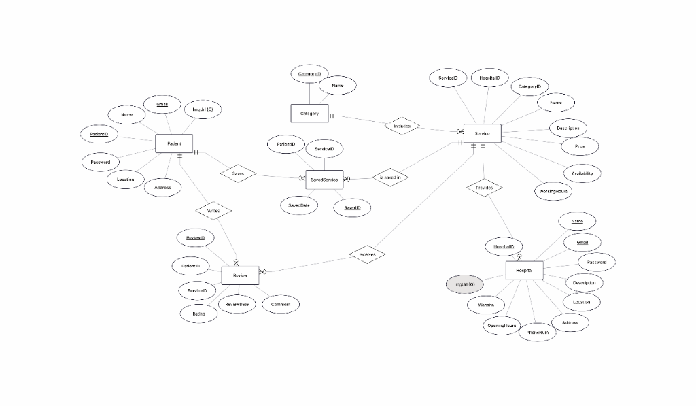

# Database Design & Data Modeling

**Project Name:** Mos3ef

## 3.1 Tech Stack
*   **Database Engine:** Microsoft SQL Server.
*   **ORM:** Entity Framework Core (Code-First Approach).

## 3.2 ERD (Entity Relationship Diagram)

## 3.3 Database Schema (Physical Data Model)

