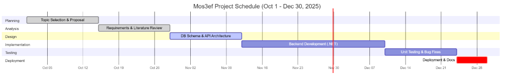

# Project Timeline (Gantt Chart)

The Gantt chart visualizes the project timeline (~13 weeks) from Planning (Oct 1) to Deployment (Dec 30).

*   **Start Date:** October 1, 2025
*   **Deadline:** December 30, 2025 (final deployment and documentation)

## Phase Durations

*   **Planning:** 2 weeks (Oct 1 – Oct 15)
*   **Analysis:** 2 weeks (Oct 15 – Oct 29)
*   **Design:** 2 weeks (Oct 29 – Nov 12)
*   **Implementation:** 4 weeks (Nov 12 – Dec 10)
*   **Testing:** 2 weeks (Dec 10 – Dec 24)
*   **Deployment:** 6 days (Dec 24 – Dec 30)
